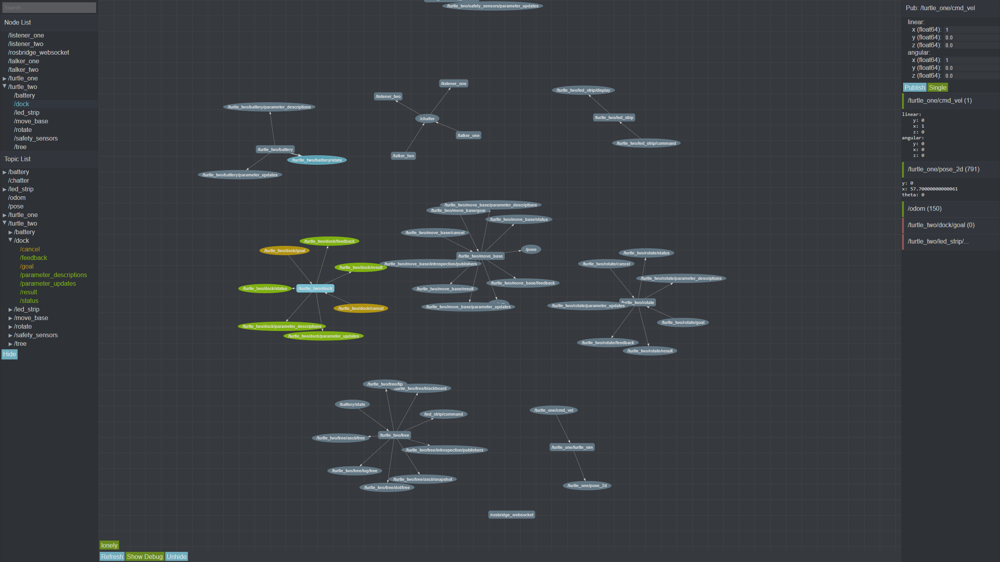

# Content

<!-- TOC depthFrom:1 depthTo:6 withLinks:1 updateOnSave:1 orderedList:0 -->

- [Goals](#goals)
- [Demo](#demo)
- [Tasks](#tasks)
  - [Priority 1](#priority-1)
  - [Priority 2](#priority-2)
  - [Future](#future)

<!-- /TOC -->

# Goals

While current ROS GUI/CLI tools exist to monitor your robots they require full
access to the robot network and force you to have ROS installed on the system
you are monitoring from. This means that monitoring a ROS system remotely is
almost impossible.

By utilizing [rosbridge-suite](https://github.com/RobotWebTools/rosbridge_suite)
jviz can be run from any browser on any device with
full access to the ROS system.

- **Freedom** : Connect and monitor your ROS robot from any device and any
  location.
- **Easy** : Easy to use means that lowers the bar for new developers getting
  into robotics.
- **Extendable** : It should be as easy as possible for new modules to be added
  to the interface to support additional features.

# Demo

There is a live version of this running on github pages.

[Demo](http://mjohnson459.github.io/jviz/)

As github only support secure sites (https) you will need to make sure that
your rosbridge server is running in secure mode. This
[ros answers](http://answers.ros.org/question/198647/rosbridge-websocket-ssl-connection-aborted/)
question contains a good starting point for enabling wss with rosbridge.

# Tasks

The immediate focus is to match the functionality of the `rostopic` tool.
`rostopic echo` and `rostopic pub`

## Priority 1

- [x] Subscriber
  - [x] Format received messages
  - [x] Steady scroll
- [x] Publisher
  - [x] Choose topic
  - [x] Fill message
  - [x] Auto fill header
  - [x] Send frequency
- [ ] Node Graph
  - [x] Nodes
  - [x] Edges
  - [ ] Namespaces
- [ ] Performance

## Priority 2
- [ ] Image viewer
- [ ] Theme
- [ ] Docker image
- [ ] Subscriber+
  - [ ] Message filter
  - [ ] Subscribe to sub-fields
- [ ] Service clients
- [ ] Action clients
- [ ] Saving dashboards locally

## Future
- [ ] Native apps
- [ ] User accounts to store dashboards, logging over time, etc
